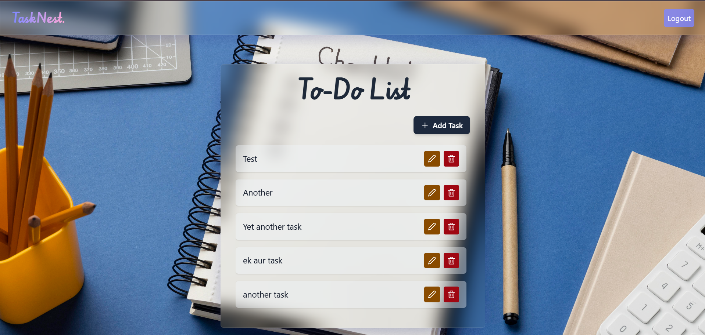
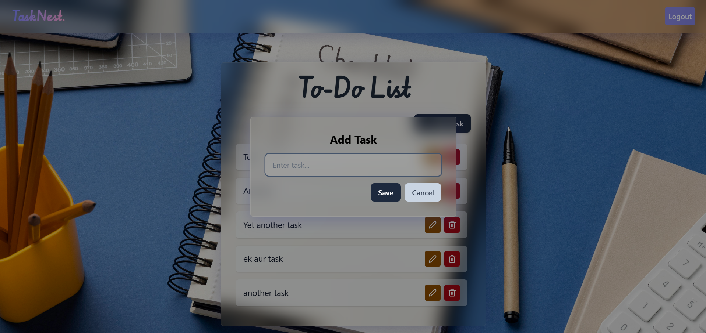

# TaskNest

A modern, full-stack To-Do List application built with React, Node.js, and MongoDB.

## Live Demo

[https://node-frontend-red.vercel.app/](https://node-frontend-red.vercel.app/)

## Getting Started

### Prerequisites
- Node.js (v16 or above recommended)
- npm or yarn

### Installation

1. **Clone the repository:**
   ```bash
   git clone <your-repo-url>
   cd node-frontend
   ```

2. **Install dependencies:**
   ```bash
   npm install
   # or
   yarn install
   ```

3. **Start the development server:**
   ```bash
   npm run dev
   # or
   yarn dev
   ```

4. **Open your browser and visit:**
   [http://localhost:5173](http://localhost:5173)

---

## Project Structure
- `src/components/` — React components (Header, Todo, Auth, etc.)
- `src/index.css` — Tailwind CSS and custom styles
- `vite.config.js` — Vite configuration

---

## Screenshots

- Register Page:
  
- Login Page:
  
- Todo List:
  
- Add Todo:
  

---

## Features
- User authentication (login/register)
- Add, edit, and delete tasks
- Responsive glassmorphism UI
- Smooth animations and feedback

---

## License
MIT